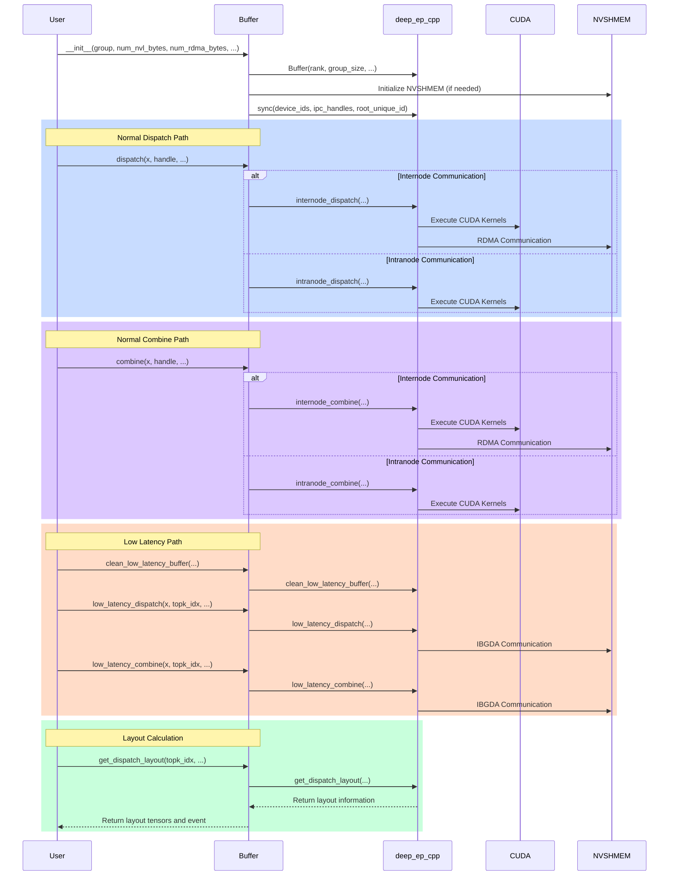

## Buffer

```mermaid
sequenceDiagram
    participant User
    participant Buffer
    participant deep_ep_cpp
    participant CUDA
    participant NVSHMEM

    %% Initialization
    User->>Buffer: __init__(group, num_nvl_bytes, num_rdma_bytes, ...)
    Buffer->>deep_ep_cpp: Buffer(rank, group_size, ...)
    Buffer->>NVSHMEM: Initialize NVSHMEM (if needed)
    Buffer->>deep_ep_cpp: sync(device_ids, ipc_handles, root_unique_id)

    %% Dispatch Flow
    rect rgb(200, 220, 255)
        Note over User,Buffer: Normal Dispatch Path
        User->>Buffer: dispatch(x, handle, ...)
        alt Internode Communication
            Buffer->>deep_ep_cpp: internode_dispatch(...)
            deep_ep_cpp->>CUDA: Execute CUDA Kernels
            deep_ep_cpp->>NVSHMEM: RDMA Communication
        else Intranode Communication
            Buffer->>deep_ep_cpp: intranode_dispatch(...)
            deep_ep_cpp->>CUDA: Execute CUDA Kernels
        end
    end

    %% Combine Flow
    rect rgb(220, 200, 255)
        Note over User,Buffer: Normal Combine Path
        User->>Buffer: combine(x, handle, ...)
        alt Internode Communication
            Buffer->>deep_ep_cpp: internode_combine(...)
            deep_ep_cpp->>CUDA: Execute CUDA Kernels
            deep_ep_cpp->>NVSHMEM: RDMA Communication
        else Intranode Communication
            Buffer->>deep_ep_cpp: intranode_combine(...)
            deep_ep_cpp->>CUDA: Execute CUDA Kernels
        end
    end

    %% Low Latency Path
    rect rgb(255, 220, 200)
        Note over User,Buffer: Low Latency Path
        User->>Buffer: clean_low_latency_buffer(...)
        Buffer->>deep_ep_cpp: clean_low_latency_buffer(...)
        
        User->>Buffer: low_latency_dispatch(x, topk_idx, ...)
        Buffer->>deep_ep_cpp: low_latency_dispatch(...)
        deep_ep_cpp->>NVSHMEM: IBGDA Communication
        
        User->>Buffer: low_latency_combine(x, topk_idx, ...)
        Buffer->>deep_ep_cpp: low_latency_combine(...)
        deep_ep_cpp->>NVSHMEM: IBGDA Communication
    end

    %% Layout Calculation
    rect rgb(200, 255, 220)
        Note over User,Buffer: Layout Calculation
        User->>Buffer: get_dispatch_layout(topk_idx, ...)
        Buffer->>deep_ep_cpp: get_dispatch_layout(...)
        deep_ep_cpp-->>Buffer: Return layout information
        Buffer-->>User: Return layout tensors and event
    end
```