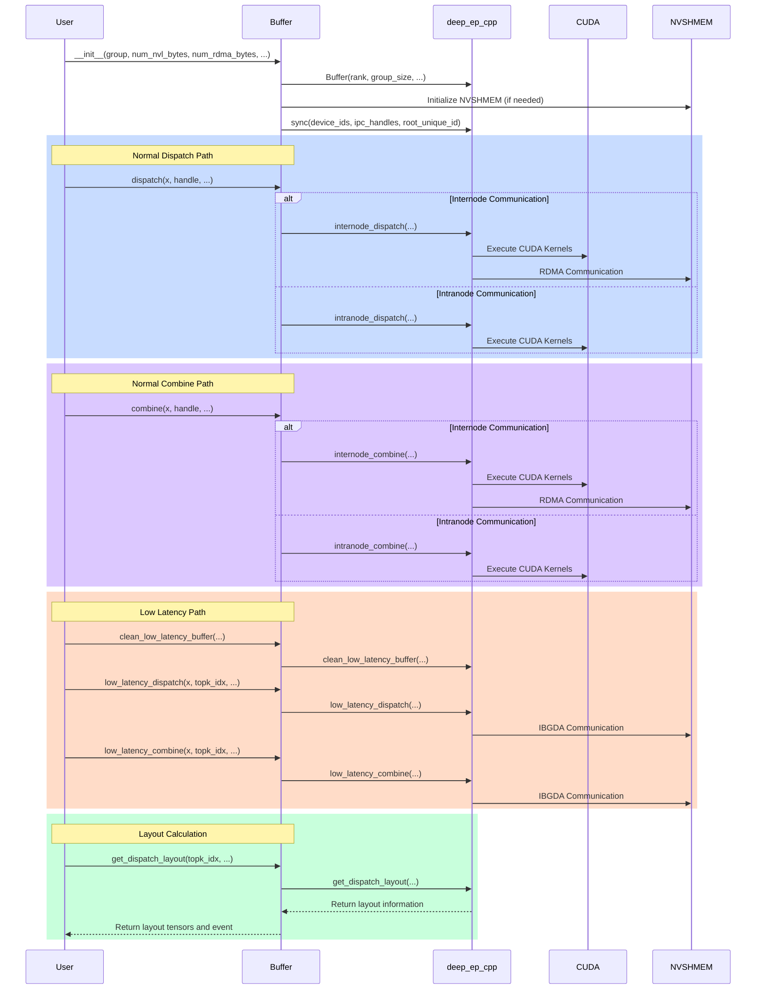
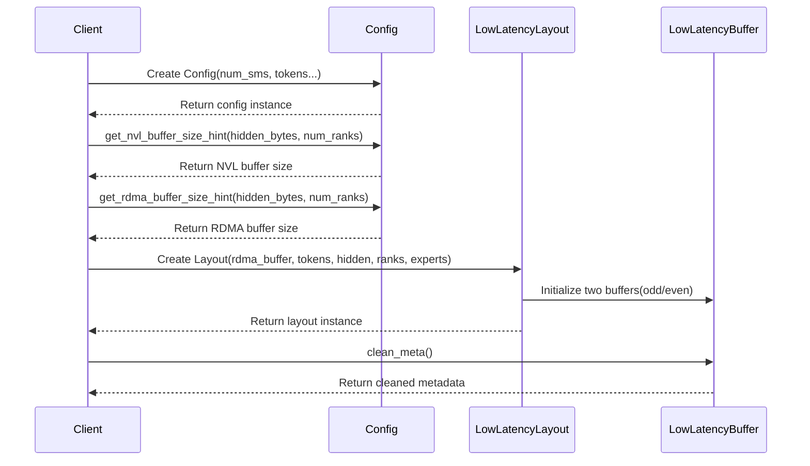

## deep_ep/buffer.py


## csrc/config.hpp


### NVL Buffer Size (when num_ranks > 0, align to 128 bytes)
[get_nvl_buffer_size_hint](https://github.com/liz-badada/DeepEP/blob/deepep_study/csrc/config.hpp#L45-L65)
```math
\begin{aligned}
\text{NVL\_Buffer\_Size} = \frac{((C \cdot R_{nvl} \cdot S_{total}) + 127 ) \cdot 128}{128}
\end{aligned}
```
where:
```math
\begin{aligned}
& C = \text{num\_channels} = \frac{\text{num\_sms}}{2} \\
& R_{nvl} = \min(\text{num\_ranks}, \text{NUM\_MAX\_NVL\_PEERS}) \\
& S_{total} = (2R_{rdma} + 3) \cdot \text{sizeof(int)} + T_{recv} \cdot (S_{data} + S_{meta} + S_{topk} + S_{scale}) \\
& R_{rdma} = \max(\frac{\text{num\_ranks}}{\text{NUM\_MAX\_NVL\_PEERS}}, 1) \\
& T_{recv} = \text{num\_max\_nvl\_chunked\_recv\_tokens} \\
& S_{data} = \text{hidden\_bytes} \\
& S_{meta} = \text{source\_meta\_bytes} \\
& S_{topk} = 128 \cdot (\text{sizeof(int64\_t)} + \text{sizeof(float)}) \\
& S_{scale} = 128 \cdot \text{sizeof(float)}
\end{aligned}
```

### RDMA Buffer Size (when num_ranks ≤ NUM_MAX_NVL_PEERS, align to 128 bytes)
[get_rdma_buffer_size_hint](https://github.com/liz-badada/DeepEP/blob/deepep_study/csrc/config.hpp#L67-L91)
```math
\begin{aligned}
& \text{RDMA\_Buffer\_Size} = \frac{((C \cdot R_{rdma} \cdot 2S_{total}) + 127 ) \cdot 128}{128}
\end{aligned}
```
where:
```math
\begin{aligned}
& C = \text{num\_channels} = \frac{\text{num\_sms}}{2} \\
& R_{rdma} = \frac{\text{num\_ranks}}{\text{NUM\_MAX\_NVL\_PEERS}} \\
& S_{total} = (2N_{nvl} + 2) \cdot \text{sizeof(int)} + \quad T_{recv} \cdot (S_{data} + S_{meta} + S_{topk} + S_{scale} + S_{int4}) \\
& N_{nvl} = \text{NUM\_MAX\_NVL\_PEERS} \\
& T_{recv} = \text{num\_max\_rdma\_chunked\_recv\_tokens} \\
& S_{data} = \text{hidden\_bytes} \\
& S_{meta} = \text{source\_meta\_bytes} \\
& S_{topk} = 128 \cdot (\text{sizeof(int64\_t)} + \text{sizeof(float)}) \\
& S_{scale} = 128 \cdot \text{sizeof(float)} \\
& S_{int4} = \text{sizeof(int4)}
\end{aligned}
```

### Normal Dispatch / Combine Buffer Notes
- All calculation results are aligned to 128 bytes
- RDMA buffer size includes bidirectional communication ($\times 2$)
- Both buffers contain space for control information, data, metadata, TopK, and scale factors
- Constants
    <center>

    | Constant | Value | Description |
    |---|---|---|
    | NUM_MAX_NVL_PEERS | 8 | Maximum number of NVL peers |
    | NUM_MAX_RDMA_PEERS | 20 | Maximum number of RDMA peers |
    | NUM_MAX_FIFO_SLOTS | 32768 | Maximum number of FIFO slots |
    | NUM_WORKSPACE_BYTES | 32 * 1024 * 1024 | Workspace size in bytes (32MB) |
    | NUM_MAX_LOCAL_EXPERTS | 1024 | Maximum number of local experts |
    | NUM_BUFFER_ALIGNMENT_BYTES | 128 | Buffer alignment size in bytes |
    | FINISHED_SUM_TAG | 1024 | Finished sum tag |
    | NUM_CPU_TIMEOUT_SECS | 100 | CPU timeout in seconds |
    | NUM_TIMEOUT_CYCLES | 200000000000ull | Timeout cycles (~100s) |
    | NUM_WAIT_NANOSECONDS | 500 | Wait time in nanoseconds |

    </center>

### Low Latency Buffer Size
[get_low_latency_rdma_size_hint](https://github.com/liz-badada/DeepEP/blob/deepep_study/csrc/config.hpp#L123-L180)

Message Size
```math
\begin{aligned}
& \text{Message\_dispatch} = \text{hidden\_size} + N_{s} \cdot 4 + 4 \\
& \text{Message\_combine} = 4 + \text{hidden\_size} \cdot 2 \\
\end{aligned}
```

Send Buffer
```math
\begin{aligned}
& \text{Send\_dispatch} = N_{t} \cdot \text{Message\_dispatch} \\
& \text{Send\_combine} = N_{e} \cdot N_{t} \cdot \text{Message\_combine} \\
& \text{Send\_total} = 2 \cdot \max(\text{Send\_dispatch}, \text{Send\_combine}) \\
\end{aligned}
```

Recv Buffer
```math
\begin{aligned}
& \text{Recv\_dispatch} = N_{e} \cdot N_{t} \cdot \text{Message\_dispatch} \\
& \text{Recv\_combine} = N_{e} \cdot N_{t} \cdot \text{Message\_combine} \\
& \text{Recv\_total} = 2 \cdot \max(\text{Recv\_dispatch}, \text{Recv\_combine}) \\
\end{aligned}
```

Signal Buffer
```math
\begin{aligned}
& \text{Signal\_count} = N_{e} \cdot 4 \\
& \text{Signal\_token} = \frac{N_{e}}{N_{r}} \cdot 4 \\
& \text{Signal\_total} = 2 \cdot \max(\text{Signal\_count} + \text{Signal\_token}, \text{Signal\_count}) \\
\end{aligned}
```

Total & Align to 128 Bytes
```math
\begin{aligned}
& \text{Bytes\_total} = \text{Send\_total} + \text{Recv\_total} + \text{Signal\_total} \\
& \text{Bytes\_aligned} = \left\lceil \frac{\text{Bytes\_total}}{128} \right\rceil \cdot 128 \\
\end{aligned}
```

where
```math
\begin{aligned}
& N_{s} = \text{num\_scales} = \frac{\text{hidden\_size}}{128} \\
& N_{t} = \text{num\_max\_dispatch\_tokens\_per\_rank} \\
& N_{e} = \text{num\_experts} \\
& N_{r} = \text{num\_ranks} \\
\end{aligned}
```

### Low Latency Dispatch / Combine Buffer Notes
- Double buffering design (×2)
- Buffer sizes for both dispatch and combine operations
- Memory alignment requirements