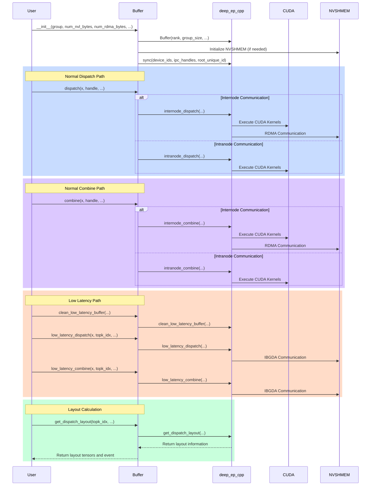
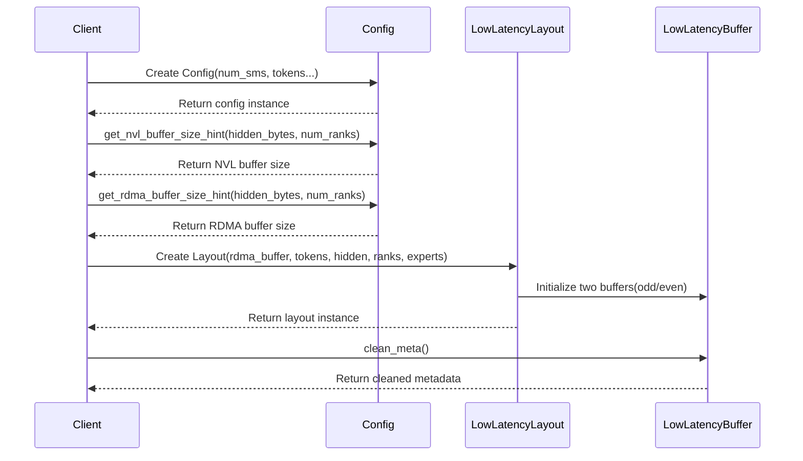

## deep_ep/buffer.py


## csrc/config.hpp


### NVL Buffer Size (when num_ranks > 0, align to 128 bytes)
- [get_nvl_buffer_size_hint](https://github.com/liz-badada/DeepEP/blob/deepep_study/csrc/config.hpp#L45-L65)
    ```math
    \begin{aligned}
    \text{NVL\_Buffer\_Size} = \frac{((C \cdot R_{nvl} \cdot S_{total}) + 127 ) \cdot 128}{128}
    \end{aligned}
    ```
    - where:
        ```math
        \begin{aligned}
        & C = \text{num\_channels} = \frac{\text{num\_sms}}{2} \\
        & R_{nvl} = \min(\text{num\_ranks}, \text{NUM\_MAX\_NVL\_PEERS}) \\
        & S_{total} = (2R_{rdma} + 3) \cdot \text{sizeof(int)} + T_{recv} \cdot (S_{data} + S_{meta} + S_{topk} + S_{scale}) \\
        & R_{rdma} = \max(\frac{\text{num\_ranks}}{\text{NUM\_MAX\_NVL\_PEERS}}, 1) \\
        & T_{recv} = \text{num\_max\_nvl\_chunked\_recv\_tokens} \\
        & S_{data} = \text{hidden\_bytes} \\
        & S_{meta} = \text{source\_meta\_bytes} \\
        & S_{topk} = 128 \cdot (\text{sizeof(int64\_t)} + \text{sizeof(float)}) \\
        & S_{scale} = 128 \cdot \text{sizeof(float)}
        \end{aligned}
        ```

### RDMA Buffer Size (when num_ranks ≤ NUM_MAX_NVL_PEERS, align to 128 bytes)
- [get_rdma_buffer_size_hint](https://github.com/liz-badada/DeepEP/blob/deepep_study/csrc/config.hpp#L67-L91)
    ```math
    \begin{aligned}
    & \text{RDMA\_Buffer\_Size} = \frac{((C \cdot R_{rdma} \cdot 2S_{total}) + 127 ) \cdot 128}{128}
    \end{aligned}
    ```
    - where:
        ```math
        \begin{aligned}
        & C = \text{num\_channels} = \frac{\text{num\_sms}}{2} \\
        & R_{rdma} = \frac{\text{num\_ranks}}{\text{NUM\_MAX\_NVL\_PEERS}} \\
        & S_{total} = (2N_{nvl} + 2) \cdot \text{sizeof(int)} + \quad T_{recv} \cdot (S_{data} + S_{meta} + S_{topk} + S_{scale} + S_{int4}) \\
        & N_{nvl} = \text{NUM\_MAX\_NVL\_PEERS} \\
        & T_{recv} = \text{num\_max\_rdma\_chunked\_recv\_tokens} \\
        & S_{data} = \text{hidden\_bytes} \\
        & S_{meta} = \text{source\_meta\_bytes} \\
        & S_{topk} = 128 \cdot (\text{sizeof(int64\_t)} + \text{sizeof(float)}) \\
        & S_{scale} = 128 \cdot \text{sizeof(float)} \\
        & S_{int4} = \text{sizeof(int4)}
        \end{aligned}
        ```

### Notes for Normal Dispatch / Combine Buffer
- All calculation results are aligned to 128 bytes
- RDMA buffer size includes bidirectional communication ($\times 2$)
- Both buffers contain space for control information, data, metadata, TopK, and scale factors
- Constants
    <center>

    | Constant | Value | Description |
    |---|---|---|
    | NUM_MAX_NVL_PEERS | 8 | Maximum number of NVL peers |
    | NUM_MAX_RDMA_PEERS | 20 | Maximum number of RDMA peers |
    | NUM_MAX_FIFO_SLOTS | 32768 | Maximum number of FIFO slots |
    | NUM_WORKSPACE_BYTES | 32 * 1024 * 1024 | Workspace size in bytes (32MB) |
    | NUM_MAX_LOCAL_EXPERTS | 1024 | Maximum number of local experts |
    | NUM_BUFFER_ALIGNMENT_BYTES | 128 | Buffer alignment size in bytes |
    | FINISHED_SUM_TAG | 1024 | Finished sum tag |
    | NUM_CPU_TIMEOUT_SECS | 100 | CPU timeout in seconds |
    | NUM_TIMEOUT_CYCLES | 200000000000ull | Timeout cycles (~100s) |
    | NUM_WAIT_NANOSECONDS | 500 | Wait time in nanoseconds |

    </center>

### Low Latency Buffer Size (align to 128 bytes)
- [get_low_latency_rdma_size_hint](https://github.com/liz-badada/DeepEP/blob/deepep_study/csrc/config.hpp#L123-L180)
    - 2 symmetric odd/even send_buffers + 2 symmetric odd/even recv_buffers + 2 symmetric odd/even signaling buffers
    - dispatch could be BF16 or FP8, combine should be BF16
    ```math
    \begin{aligned}
    & \text{Low\_Latency\_Buffer\_Size} = \left\lceil \frac{2 \cdot Bytes_{send\_buffer} + 2 \cdot Bytes_{recv\_buffer} + 2 \cdot Bytes_{signal\_buffer}}{128} \right\rceil \cdot 128 \\
    \end{aligned}
    ```
    - where:
        ```math
        \begin{aligned}
        & Bytes_{dispatch\_msg} = \text{sizeof(int4)} + \max(\text{hidden\_size} \cdot \text{sizeof(nv\_bfloat16)},\ \text{hidden\_size} + N_{s} \cdot \text{sizeof(float)}) \\
        & Bytes_{combine\_msg} = \text{sizeof(int4)} + \text{hidden\_size} \cdot \text{sizeof(nv\_bfloat16)} \\

        & Bytes_{send\_dispatch\_buffer} = N_{t} \cdot Bytes_{dispatch\_msg} \\
        & Bytes_{send\_combine\_buffer} = N_{e} \cdot N_{t} \cdot Bytes_{combine\_msg} \\
        & Bytes_{send\_buffer} = \max(Bytes_{send\_dispatch\_buffer}, Bytes_{send\_combine\_buffer}) \\
        & Bytes_{recv\_dispatch\_buffer} = N_{e} \cdot N_{t} \cdot Bytes_{dispatch\_msg} \\
        & Bytes_{recv\_combine\_buffer} = N_{e} \cdot N_{t} \cdot Bytes_{combine\_msg} \\
        & Bytes_{recv\_buffer} = \max(Bytes_{recv\_dispatch\_buffer}, Bytes_{recv\_combine\_buffer}) \\

        & Bytes_{signal\_dispatch\_recv\_count} = N_{e} \cdot \text{sizeof(int)} \\
        & Bytes_{signal\_combine\_recv\_flag} = Bytes_{signal\_dispatch\_recv\_count} \\
        & Bytes_{signal\_buffer} = \max(Bytes_{signal\_dispatch\_recv\_count},\ Bytes_{signal\_combine\_recv\_flag}) \\

        & N_{s} = \text{num\_scales} = \frac{\text{hidden\_size}}{128} \\
        & N_{t} = \text{num\_max\_dispatch\_tokens\_per\_rank} \\
        & N_{e} = \text{num\_experts} \\
        & N_{r} = \text{num\_ranks} \\
        \end{aligned}
        ```

- example:

    - set: 
        ```math
        \text{hidden\_size}=7168,\ N_{s}=\frac{\text{hidden\_size}}{128}=56,\ N_{t}=128,\ N_{e}=256,\ N_{r}=8
        ```
    - then:
        ```math
        \begin{aligned}
        & Bytes_{dispatch\_msg} = 16 + \max(7168 \cdot 2,\ 7168 + 56 \cdot 4) = 14,352 \\
        & Bytes_{combine\_msg} = 16 + 7168 \cdot 2 = 14,352 \\

        & Bytes_{send\_dispatch\_buffer} = 128 \cdot (14,352) = 1,837,056 \\
        & Bytes_{send\_combine\_buffer} = 256 \cdot 128 \cdot (14,352) = 470,286,336 \\
        & Bytes_{send\_buffer} = \max(1,837,056,\ 470,286,336) = 470,286,336 \\
        & Bytes_{recv\_dispatch\_buffer} = 256 \cdot 128 \cdot (14,352) = 470,286,336 \\
        & Bytes_{recv\_combine\_buffer} = 256 \cdot 128 \cdot (14,352) = 470,286,336 \\
        & Bytes_{recv\_buffer} = \max(470,286,336,\ 470,286,336) = 470,286,336 \\

        & Bytes_{signal\_dispatch\_recv\_count} = 256 \cdot 4 = 1,024 \\
        & Bytes_{signal\_combine\_recv\_flag} = Bytes_{signal\_dispatch\_recv\_count} = 1,024 \\
        & Bytes_{signal\_buffer} = \max(1,024, \ 1,024) = 1,024 \\

        & \text{Low\_Latency\_Buffer\_Size} = \frac{(2 \cdot (470,286,336) + 2 \cdot (470,286,336) + 2 \cdot (1,024) + 128)}{128} \cdot 128 = 1,881,147,520 \approx 1.8 GB \\
        \end{aligned}
        ```
    - log:
        ```sh
        >>> get_low_latency_rdma_size_hint, num_rdma_bytes: 1881147520
        ```

### Notes for Low Latency Dispatch / Combine Buffer
- Double buffering design (×2)
- Buffer sizes for both dispatch and combine operations
- Memory alignment requirements