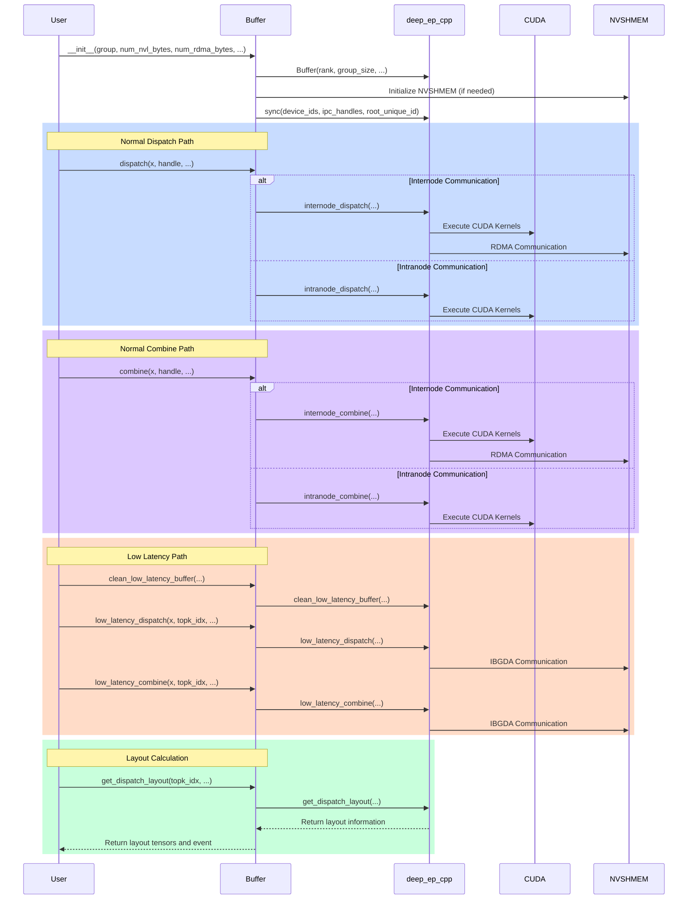
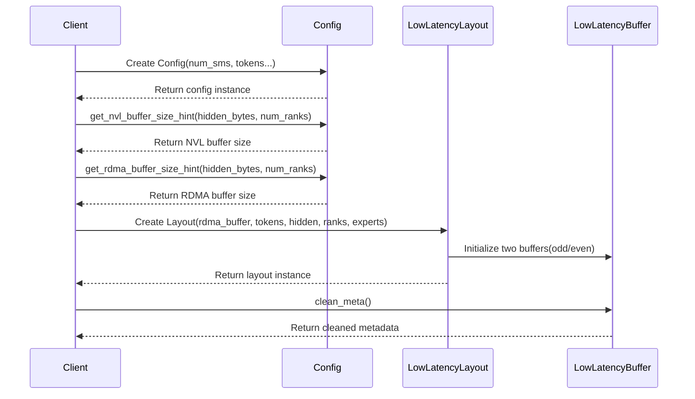

## deep_ep/buffer.py


## csrc/config.hpp


### Normal NVL Buffer Size (when num_ranks > 0, align to 128 bytes)
- [get_nvl_buffer_size_hint](https://github.com/liz-badada/DeepEP/blob/deepep_study/csrc/config.hpp#L45-L65)
    ```math
    \begin{aligned}
    \text{NVL\_Buffer\_Size} = \frac{((C \cdot R_{nvl} \cdot Bytes_{total}) + 127 ) \cdot 128}{128}
    \end{aligned}
    ```
    - where:
        ```math
        \begin{aligned}
        & C = \text{num\_channels} = \frac{N_{SM}}{2} \\
        & R_{nvl} = \min(N_{r}, \text{NUM\_MAX\_NVL\_PEERS}) \\
        \end{aligned}
        ```
        ```math
        \begin{aligned}
        & Bytes_{total} = (2R_{rdma} + 3) \cdot \text{sizeof(int)} + N_{t\_recv\_nvl} \cdot (Bytes_{hidden} + Bytes_{src\_meta} + Bytes_{topk} + Bytes_{scale}) \\
        & R_{rdma} = \max(\frac{N_{r}}{\text{NUM\_MAX\_NVL\_PEERS}}, 1) \\
        \end{aligned}
        ```
        ```math
        \begin{aligned}
        & Bytes_{hidden} = \text{hidden\_bytes} = \text{hidden\_size} \cdot \max(\text{element\_size},\ 2) \\
        & Bytes_{src\_meta} = \text{source\_meta\_bytes} \\
        & Bytes_{topk} = N_{topk} \cdot (\text{sizeof(int64\_t)} + \text{sizeof(float)}) \\
        & Bytes_{scale} = N_{s} \cdot \text{sizeof(float)} \\
        \end{aligned}
        ```
        ```math
        \begin{aligned}
        & N_{topk} = \text{kNumMaxTopK} = 128 \\
        & N_{s} = \text{kNumMaxScales} = 128 \\
        & N_{r} = \text{num\_ranks} \\
        & N_{SM} = 20 \\
        & N_{t\_send\_nvl} = \text{num\_max\_nvl\_chunked\_send\_tokens} \\
        & N_{t\_recv\_nvl} = \text{num\_max\_nvl\_chunked\_recv\_tokens} \\
        \end{aligned}
        ```
- example:
    - set: 
        ```math
        \text{hidden\_size}=7168,\ N_{t}=128,\ N_{r}=8,\ N_{t\_recv\_nvl}=256, N_{SM}=20
        ```
    - then:
        ```math
        \begin{aligned}
        & Bytes_{hidden} = 7168 \cdot 2 = 14336 \\
        & Bytes_{src\_meta} = \text{source\_meta\_bytes} \\
        & Bytes_{topk} = 128 \cdot (8 + 4) = 1536 \\
        & Bytes_{scale} = 128 \cdot 4 = 512 \\
        \end{aligned}
        ```
        ```math
        \begin{aligned}
        & R_{rdma} = \max(\frac{8}{8}, 1) = 1\\
        & Bytes_{total} = (2 \cdot 1 + 3) \cdot 4 + 256 \cdot (14336 + Bytes_{src\_meta} + 1536 + 512) = \\
        \end{aligned}
        ```
        ```math
        \begin{aligned}
        & C = \frac{20}{2} = 10 \\
        & R_{nvl} = \min(8, 8) = 8 \\
        \end{aligned}
        ```
        ```math
        \begin{aligned}
        & \text{NVL\_Buffer\_Size} = \frac{((10 \cdot 8 \cdot Bytes_{total}) + 127 ) \cdot 128}{128} = xxx \approx xxx GB \\
        \end{aligned}
        ```
    - log:
        ```sh
        >>> get_nvl_buffer_size_hint, num_nvl_bytes: 
        ```

### Normal RDMA Buffer Size (when num_ranks ≤ NUM_MAX_NVL_PEERS, align to 128 bytes)
- [get_rdma_buffer_size_hint](https://github.com/liz-badada/DeepEP/blob/deepep_study/csrc/config.hpp#L67-L91)
    ```math
    \begin{aligned}
    & \text{RDMA\_Buffer\_Size} = \frac{((C \cdot R_{rdma} \cdot 2Bytes_{total}) + 127 ) \cdot 128}{128}
    \end{aligned}
    ```
    - where:
        ```math
        \begin{aligned}
        & C = \text{num\_channels} = \frac{N_{SM}}{2} \\
        & R_{rdma} = \frac{N_{r}}{\text{NUM\_MAX\_NVL\_PEERS}} \\
        \end{aligned}
        ```
        ```math
        \begin{aligned}
        & Bytes_{total} = (2N_{nvl} + 2) \cdot \text{sizeof(int)} + \quad N_{t\_recv\_rdma} \cdot (Bytes_{hidden} + Bytes_{src\_meta} + Bytes_{topk} + Bytes_{scale} + Bytes_{header}) \\
        & N_{nvl} = \text{NUM\_MAX\_NVL\_PEERS} \\
        \end{aligned}
        ```
        ```math
        \begin{aligned}
        & Bytes_{hidden} = \text{hidden\_bytes} = \text{hidden\_size} \cdot \max(\text{element\_size},\ 2) \\
        & Bytes_{src\_meta} = \text{source\_meta\_bytes} \\
        & Bytes_{topk} = N_{topk} \cdot (\text{sizeof(int64\_t)} + \text{sizeof(float)}) \\
        & Bytes_{scale} = N_{s} \cdot \text{sizeof(float)} \\
        & Bytes_{header} = \text{sizeof(int4)} \\
        \end{aligned}
        ```
        ```math
        \begin{aligned}
        & N_{topk} = \text{kNumMaxTopK} = 128 \\
        & N_{s} = \text{kNumMaxScales} = 128 \\
        & N_{r} = \text{num\_ranks} \\
        & N_{t\_send\_rdma} = \text{num\_max\_rdma\_chunked\_send\_tokens} \\
        & N_{t\_recv\_rdma} = \text{num\_max\_rdma\_chunked\_recv\_tokens} \\
        \end{aligned}
        ```
- example:
    - set: 
        ```math
        \text{hidden\_size}=7168,\ N_{t}=128,\ N_{r}=8,\ N_{t\_recv\_rdma}=128, N_{SM}=20
        ```
    - then:
        ```math
        \begin{aligned}
        & Bytes_{hidden} = 7168 \cdot 2 = 14336 \\
        & Bytes_{src\_meta} = \text{source\_meta\_bytes} \\
        & Bytes_{topk} = 128 \cdot (8 + 4) = 1536 \\
        & Bytes_{scale} = 128 \cdot 4 = 512 \\
        & Bytes_{header} = 16 \\
        \end{aligned}
        ```
        ```math
        \begin{aligned}
        & N_{nvl} = 8 \\
        & Bytes_{total} = (2 \cdot 8 + 2) \cdot 4 + \quad 128 \cdot (14336 + Bytes_{src\_meta} + 1536 + 512 + 16) = \\
        \end{aligned}
        ```
        ```math
        \begin{aligned}
        & C = \frac{20}{2} = 10 \\
        & R_{rdma} = \frac{8}{8} = 1 \\
        \end{aligned}
        ```
        ```math
        \begin{aligned}
        & \text{RDMA\_Buffer\_Size} = \frac{((10 \cdot 1 \cdot 2Bytes_{total}) + 127 ) \cdot 128}{128} = xxx \approx xxx GB \\
        \end{aligned}
        ```
    - log:
        ```sh
        >>> get_rdma_buffer_size_hint, num_rdma_bytes: 
        ```

### Notes for Normal Dispatch / Combine Buffer
- SM count must be even, default is 20
- All calculation results are aligned to 128 bytes
- RDMA buffer size includes bidirectional communication ($\times 2$)
- Both buffers contain space for control information, data, metadata, TopK, and scale factors
- Constants
    <center>

    | Constant | Value | Description |
    |------------------|---------|--------------------------------|
    | NUM_MAX_NVL_PEERS | 8 | Maximum number of NVL peers |
    | NUM_MAX_RDMA_PEERS | 20 | Maximum number of RDMA peers |
    | NUM_MAX_FIFO_SLOTS | 32768 | Maximum number of FIFO slots |
    | NUM_WORKSPACE_BYTES | 32 * 1024 * 1024 | Workspace size in bytes (32MB) |
    | NUM_MAX_LOCAL_EXPERTS | 1024 | Maximum number of local experts |
    | NUM_BUFFER_ALIGNMENT_BYTES | 128 | Buffer alignment size in bytes |
    | FINISHED_SUM_TAG | 1024 | Finished sum tag |
    | NUM_CPU_TIMEOUT_SECS | 100 | CPU timeout in seconds |
    | NUM_TIMEOUT_CYCLES | 200000000000ull | Timeout cycles (~100s) |
    | NUM_WAIT_NANOSECONDS | 500 | Wait time in nanoseconds |

    </center>
- Dispatch / combine config for different ranks
    <center>

    | $N_{r}$ | $N_{SM}$ | Dispatch $N_{t\_send\_nvl}$ | Dispatch $N_{t\_recv\_nvl}$ | Dispatch $N_{t\_send\_rdma}$ | Dispatch $N_{t\_recv\_rdma}$ | Combine $N_{t\_send\_nvl}$ | Combine $N_{t\_recv\_nvl}$ | Combine $N_{t\_send\_rdma}$ | Combine $N_{t\_recv\_rdma}$ |
    |---------|---------|--------------------------------|--------------------------------|----------------------------------|----------------------------------|--------------------------------|--------------------------------|----------------------------------|----------------------------------|
    | 2 | 20 | 16 | 256 | 6 | 128 | 6 | 256 | 6 | 128 |
    | 4 | 20 | 16 | 256 | 6 | 128 | 6 | 256 | 6 | 128 |
    | 8 | 20 | 6 | 256 | 6 | 128 | 6 | 256 | 6 | 128 |
    | 16 | 20 | 16 | 288 | 20 | 128 | 2 | 288 | 28 | 128 |
    | 24 | 20 | 8 | 288 | 32 | 128 | 1 | 288 | 20 | 128 |
    | 32 | 20 | 8 | 288 | 32 | 128 | 1 | 288 | 20 | 128 |
    | 64 | 20 | 20 | 288 | 28 | 128 | 1 | 288 | 20 | 128 |
    | 128 | 20 | 20 | 560 | 32 | 128 | 1 | 560 | 12 | 128 |
    | 144 | 20 | 32 | 720 | 12 | 128 | 2 | 720 | 8 | 128 |
    | 160 | 20 | 28 | 720 | 12 | 128 | 2 | 720 | 8 | 128 |

    </center>

### Low Latency Buffer Size (align to 128 bytes)
- [get_low_latency_rdma_size_hint](https://github.com/liz-badada/DeepEP/blob/deepep_study/csrc/config.hpp#L123-L180)
    ```math
    \begin{aligned}
    & \text{Low\_Latency\_Buffer\_Size} = \frac{(2 \cdot Bytes_{send\_buffer} + 2 \cdot Bytes_{recv\_buffer} + 2 \cdot Bytes_{signal\_buffer} + 128)}{128} \cdot 128 \\
    \end{aligned}
    ```
    - where:
        ```math
        \begin{aligned}
        & Bytes_{dispatch\_msg} = \text{sizeof(int4)} + \max(\text{hidden\_size} \cdot \text{sizeof(nv\_bfloat16)},\ \text{hidden\_size} + N_{s} \cdot \text{sizeof(float)}) \\
        & Bytes_{combine\_msg} = \text{sizeof(int4)} + \text{hidden\_size} \cdot \text{sizeof(nv\_bfloat16)} \\
        \end{aligned}
        ```
        ```math
        \begin{aligned}
        & Bytes_{send\_dispatch\_buffer} = N_{t} \cdot Bytes_{dispatch\_msg} \\
        & Bytes_{send\_combine\_buffer} = N_{e} \cdot N_{t} \cdot Bytes_{combine\_msg} \\
        & Bytes_{send\_buffer} = \max(Bytes_{send\_dispatch\_buffer},\ Bytes_{send\_combine\_buffer}) \\
        \end{aligned}
        ```
        ```math
        \begin{aligned}
        & Bytes_{recv\_dispatch\_buffer} = N_{e} \cdot N_{t} \cdot Bytes_{dispatch\_msg} \\
        & Bytes_{recv\_combine\_buffer} = N_{e} \cdot N_{t} \cdot Bytes_{combine\_msg} \\
        & Bytes_{recv\_buffer} = \max(Bytes_{recv\_dispatch\_buffer},\ Bytes_{recv\_combine\_buffer}) \\
        \end{aligned}
        ```
        ```math
        \begin{aligned}
        & Bytes_{signal\_dispatch\_recv\_count} = N_{e} \cdot \text{sizeof(int)} \\
        & Bytes_{signal\_combine\_recv\_flag} = Bytes_{signal\_dispatch\_recv\_count} \\
        & Bytes_{signal\_buffer} = \max(Bytes_{signal\_dispatch\_recv\_count},\ Bytes_{signal\_combine\_recv\_flag}) \\
        \end{aligned}
        ```
        ```math
        \begin{aligned}
        & N_{s} = \text{num\_scales} = \frac{\text{hidden\_size}}{128} \\
        & N_{t} = \text{num\_max\_dispatch\_tokens\_per\_rank} \\
        & N_{e} = \text{num\_experts} \\
        & N_{r} = \text{num\_ranks} \\
        \end{aligned}
        ```

- example:
    - set: 
        ```math
        \text{hidden\_size}=7168,\ N_{s}=\frac{\text{hidden\_size}}{128}=56,\ N_{t}=128,\ N_{e}=256,\ N_{r}=8
        ```
    - then:
        ```math
        \begin{aligned}
        & Bytes_{dispatch\_msg} = 16 + \max(7168 \cdot 2,\ 7168 + 56 \cdot 4) = 14,352 \\
        & Bytes_{combine\_msg} = 16 + 7168 \cdot 2 = 14,352 \\
        \end{aligned}
        ```
        ```math
        \begin{aligned}
        & Bytes_{send\_dispatch\_buffer} = 128 \cdot (14,352) = 1,837,056 \\
        & Bytes_{send\_combine\_buffer} = 256 \cdot 128 \cdot (14,352) = 470,286,336 \\
        & Bytes_{send\_buffer} = \max(1,837,056,\ 470,286,336) = 470,286,336 \\
        \end{aligned}
        ```
        ```math
        \begin{aligned}
        & Bytes_{recv\_dispatch\_buffer} = 256 \cdot 128 \cdot (14,352) = 470,286,336 \\
        & Bytes_{recv\_combine\_buffer} = 256 \cdot 128 \cdot (14,352) = 470,286,336 \\
        & Bytes_{recv\_buffer} = \max(470,286,336,\ 470,286,336) = 470,286,336 \\
        \end{aligned}
        ```
        ```math
        \begin{aligned}
        & Bytes_{signal\_dispatch\_recv\_count} = 256 \cdot 4 = 1,024 \\
        & Bytes_{signal\_combine\_recv\_flag} = Bytes_{signal\_dispatch\_recv\_count} = 1,024 \\
        & Bytes_{signal\_buffer} = \max(1,024, \ 1,024) = 1,024 \\
        \end{aligned}
        ```
        ```math
        \begin{aligned}
        & \text{Low\_Latency\_Buffer\_Size} = \frac{(2 \cdot (470,286,336) + 2 \cdot (470,286,336) + 2 \cdot (1,024) + 128)}{128} \cdot 128 = 1,881,147,520 \approx 1.8 GB \\
        \end{aligned}
        ```
    - log:
        ```sh
        >>> get_low_latency_rdma_size_hint, num_rdma_bytes: 1881147520
        ```

#### Notes for Low Latency Dispatch / Combine Buffer
- Unlike normal dispatch / combine, low latency dispatch / combine do not repy on SM 
- Buffer sizes for dispatch / combine
    - Dispatch could be BF16 or FP8, buffer size would be max(BF16, FP8), combine should be BF16
    - Message is consist of [message header (16 bytes) + data (token size)]
    - Both Bytes_send_buffer and Bytes_recv_buffer should be times of 16 bytes
- Buffer size for signaling
    - Dispatch recv counter (track how many tokens recv by expert) need 256 for all experts (counter dtype: int), 1024 bytes in total
    - Combine recv flag (indicate recv state) need 256 for all experts, same size as distpatch recv counter, 1024 bytes in total
- Double buffering design (×2)
    - 2 symmetric odd/even send_buffers + 2 symmetric odd/even recv_buffers + 2 symmetric odd/even signaling buffers
- Memory alignment requirements
    - Align to 128