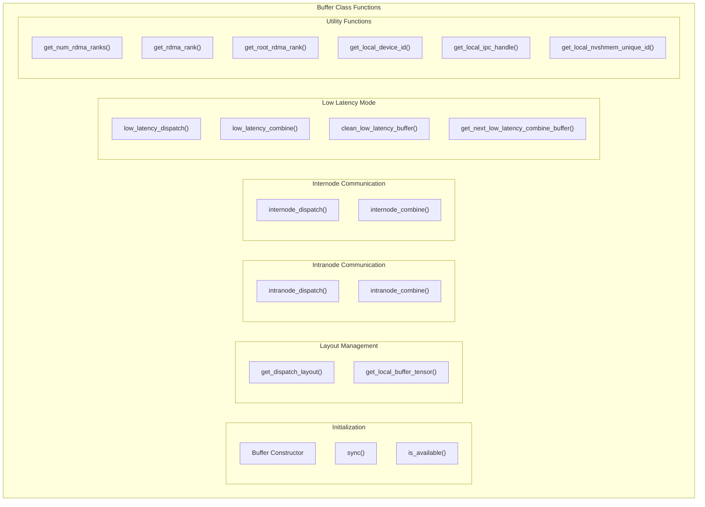

## csrc/deep_ep.cpp

```mermaid
graph TB
    subgraph Buffer Class Functions
        subgraph Initialization
            rect1["Buffer Constructor"]
            rect2["sync()"]
            rect3["is_available()"]
        end

        subgraph Layout Management
            rect4["get_dispatch_layout()"]
            rect5["get_local_buffer_tensor()"]
        end

        subgraph Intranode Communication
            rect6["intranode_dispatch()"]
            rect7["intranode_combine()"]
        end

        subgraph Internode Communication
            rect8["internode_dispatch()"]
            rect9["internode_combine()"]
        end

        subgraph Low Latency Mode
            rect10["low_latency_dispatch()"]
            rect11["low_latency_combine()"]
            rect12["clean_low_latency_buffer()"]
            rect13["get_next_low_latency_combine_buffer()"]
        end

        subgraph Utility Functions
            rect14["get_num_rdma_ranks()"]
            rect15["get_rdma_rank()"]
            rect16["get_root_rdma_rank()"]
            rect17["get_local_device_id()"]
            rect18["get_local_ipc_handle()"]
            rect19["get_local_nvshmem_unique_id()"]
        end
    end
```