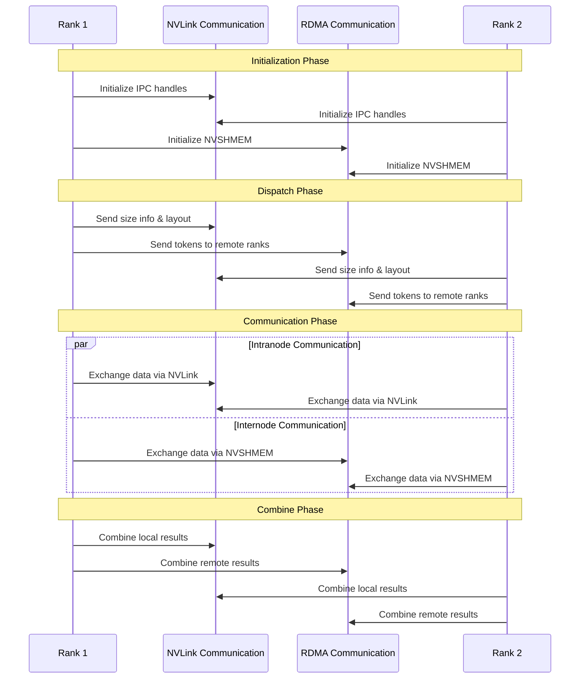

## csrc/deep_ep.cpp

```mermaid
sequenceDiagram
    participant Rank1 as Rank 1
    participant NVL as NVLink Communication
    participant RDMA as RDMA Communication 
    participant Rank2 as Rank 2

    Note over Rank1,Rank2: Initialization Phase
    Rank1->>NVL: Initialize IPC handles
    Rank2->>NVL: Initialize IPC handles
    Rank1->>RDMA: Initialize NVSHMEM
    Rank2->>RDMA: Initialize NVSHMEM

    Note over Rank1,Rank2: Dispatch Phase
    Rank1->>NVL: Send size info & layout
    Rank1->>RDMA: Send tokens to remote ranks
    Rank2->>NVL: Send size info & layout  
    Rank2->>RDMA: Send tokens to remote ranks

    Note over Rank1,Rank2: Communication Phase
    par Intranode Communication
        Rank1->>NVL: Exchange data via NVLink
        Rank2->>NVL: Exchange data via NVLink
    and Internode Communication
        Rank1->>RDMA: Exchange data via NVSHMEM
        Rank2->>RDMA: Exchange data via NVSHMEM
    end

    Note over Rank1,Rank2: Combine Phase
    Rank1->>NVL: Combine local results
    Rank1->>RDMA: Combine remote results
    Rank2->>NVL: Combine local results
    Rank2->>RDMA: Combine remote results
```