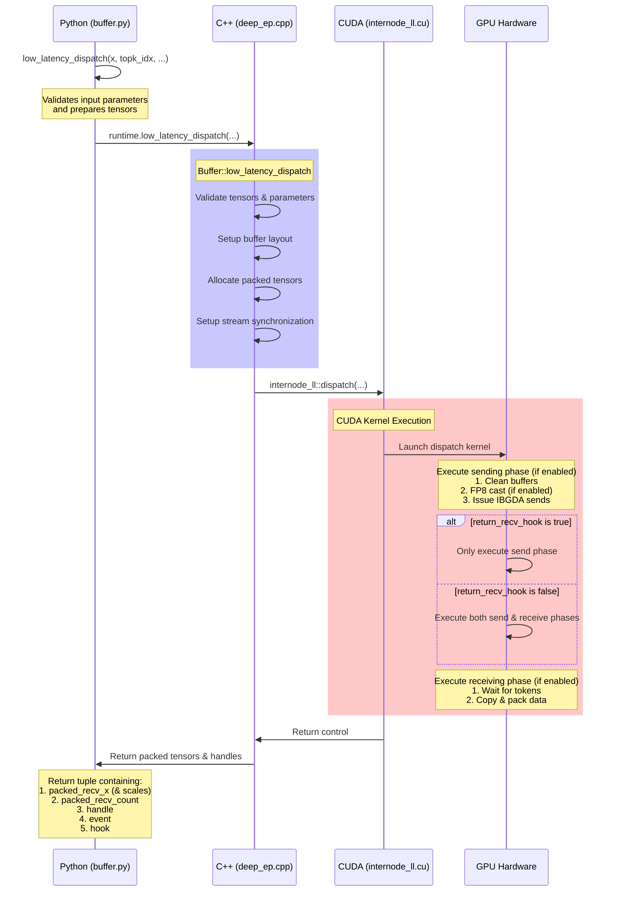

## Low Latency Dispatch

buffer.py -> deep_ep.cpp -> internode_ll.cu

```mermaid
sequenceDiagram
    participant Python as Python (buffer.py)
    participant CPP as C++ (deep_ep.cpp)
    participant CUDA as CUDA (internode_ll.cu)
    participant GPU as GPU Hardware

    Python->>Python: low_latency_dispatch(x, topk_idx, ...)
    Note over Python: Validates input parameters<br/>and prepares tensors

    Python->>CPP: runtime.low_latency_dispatch(...)
    
    rect rgb(200, 200, 255)
        Note over CPP: Buffer::low_latency_dispatch
        CPP->>CPP: Validate tensors & parameters
        CPP->>CPP: Setup buffer layout
        CPP->>CPP: Allocate packed tensors
        CPP->>CPP: Setup stream synchronization
    end

    CPP->>CUDA: internode_ll::dispatch(...)
    
    rect rgb(255, 200, 200)
        Note over CUDA: CUDA Kernel Execution
        CUDA->>GPU: Launch dispatch kernel
        Note over GPU: Execute sending phase (if enabled)<br/>1. Clean buffers<br/>2. FP8 cast (if enabled)<br/>3. Issue IBGDA sends
        
        alt return_recv_hook is true
            GPU->>GPU: Only execute send phase
        else return_recv_hook is false
            GPU->>GPU: Execute both send & receive phases
        end
        
        Note over GPU: Execute receiving phase (if enabled)<br/>1. Wait for tokens<br/>2. Copy & pack data
    end

    CUDA->>CPP: Return control
    
    CPP->>Python: Return packed tensors & handles
    
    Note over Python: Return tuple containing:<br/>1. packed_recv_x (& scales)<br/>2. packed_recv_count<br/>3. handle<br/>4. event<br/>5. hook
```