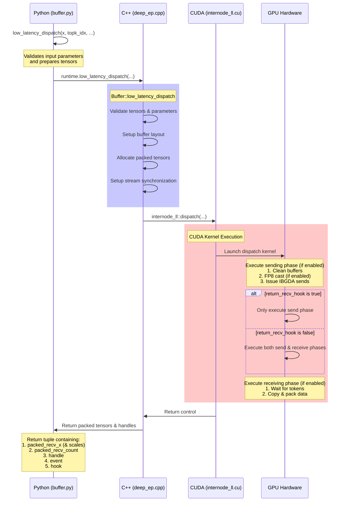
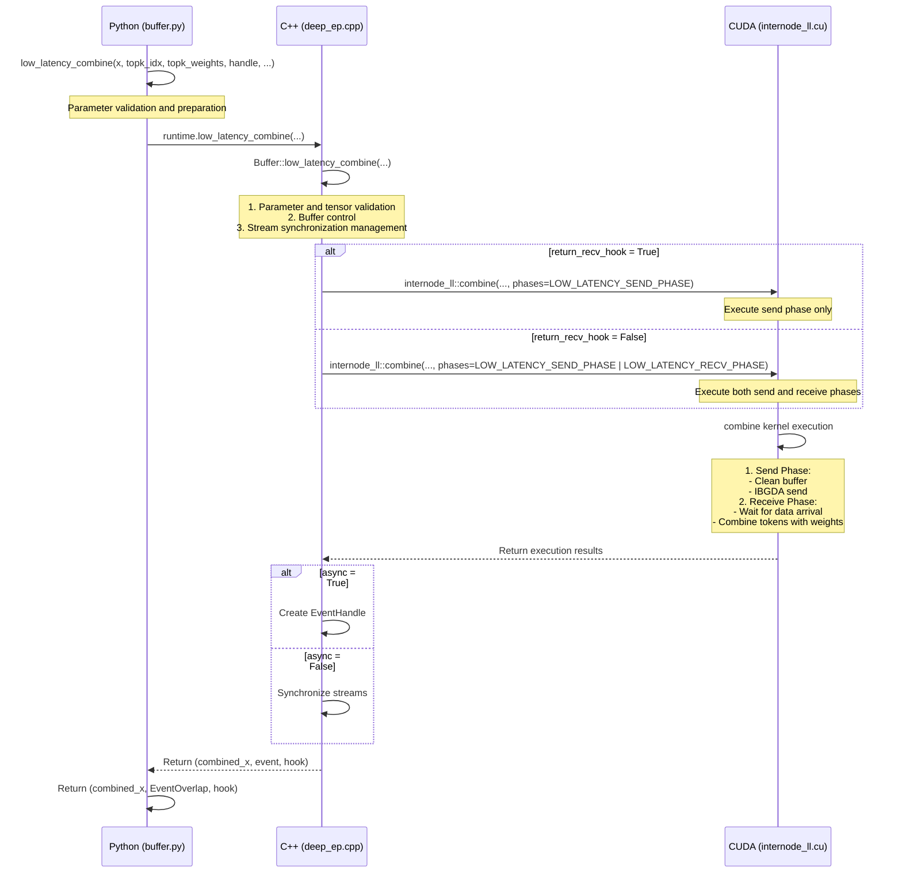

## Low Latency Dispatch (buffer.py -> deep_ep.cpp -> internode_ll.cu)

```mermaid
sequenceDiagram
    participant Python as Python (buffer.py)
    participant CPP as C++ (deep_ep.cpp)
    participant CUDA as CUDA (internode_ll.cu)
    participant GPU as GPU Hardware

    Python->>Python: low_latency_dispatch(x, topk_idx, ...)
    Note over Python: Validates input parameters<br/>and prepares tensors

    Python->>CPP: runtime.low_latency_dispatch(...)
    
    rect rgb(200, 200, 255)
        Note over CPP: Buffer::low_latency_dispatch
        CPP->>CPP: Validate tensors & parameters
        CPP->>CPP: Setup buffer layout
        CPP->>CPP: Allocate packed tensors
        CPP->>CPP: Setup stream synchronization
    end

    CPP->>CUDA: internode_ll::dispatch(...)
    
    rect rgb(255, 200, 200)
        Note over CUDA: CUDA Kernel Execution
        CUDA->>GPU: Launch dispatch kernel
        Note over GPU: Execute sending phase (if enabled)<br/>1. Clean buffers<br/>2. FP8 cast (if enabled)<br/>3. Issue IBGDA sends
        
        alt return_recv_hook is true
            GPU->>GPU: Only execute send phase
        else return_recv_hook is false
            GPU->>GPU: Execute both send & receive phases
        end
        
        Note over GPU: Execute receiving phase (if enabled)<br/>1. Wait for tokens<br/>2. Copy & pack data
    end

    CUDA->>CPP: Return control
    
    CPP->>Python: Return packed tensors & handles
    
    Note over Python: Return tuple containing:<br/>1. packed_recv_x (& scales)<br/>2. packed_recv_count<br/>3. handle<br/>4. event<br/>5. hook
```

## Low Latency Combine (buffer.py -> deep_ep.cpp -> internode_ll.cu)

```mermaid
sequenceDiagram
    participant Python as Python (buffer.py)
    participant CPP as C++ (deep_ep.cpp)
    participant CUDA as CUDA (internode_ll.cu)
    
    Python->>Python: low_latency_combine(x, topk_idx, topk_weights, handle, ...)
    Note over Python: Parameter validation and preparation
    
    Python->>CPP: runtime.low_latency_combine(...)
    
    CPP->>CPP: Buffer::low_latency_combine(...)
    Note over CPP: 1. Parameter and tensor validation<br>2. Buffer control<br>3. Stream synchronization management
    
    alt return_recv_hook = True
        CPP->>CUDA: internode_ll::combine(..., phases=LOW_LATENCY_SEND_PHASE)
        Note over CUDA: Execute send phase only
    else return_recv_hook = False
        CPP->>CUDA: internode_ll::combine(..., phases=LOW_LATENCY_SEND_PHASE | LOW_LATENCY_RECV_PHASE)
        Note over CUDA: Execute both send and receive phases
    end
    
    CUDA->>CUDA: combine kernel execution
    Note over CUDA: 1. Send Phase:<br>- Clean buffer<br>- IBGDA send<br>2. Receive Phase:<br>- Wait for data arrival<br>- Combine tokens with weights

    CUDA-->>CPP: Return execution results
    
    alt async = True
        CPP->>CPP: Create EventHandle
    else async = False
        CPP->>CPP: Synchronize streams
    end
    
    CPP-->>Python: Return (combined_x, event, hook)
    
    Python->>Python: Return (combined_x, EventOverlap, hook)
```