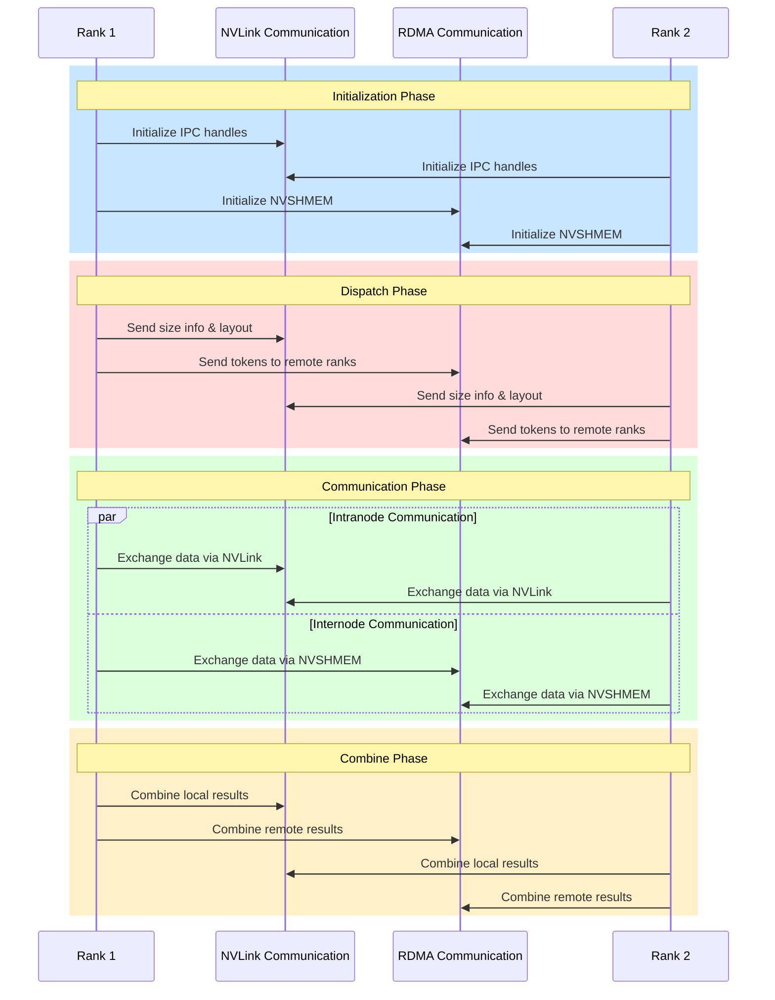

## csrc/deep_ep.cpp

```mermaid
sequenceDiagram
    participant Rank1 as Rank 1
    participant NVL as NVLink Communication
    participant RDMA as RDMA Communication 
    participant Rank2 as Rank 2

    rect rgb(200, 230, 255)
        Note over Rank1,Rank2: Initialization Phase
        Rank1->>NVL: Initialize IPC handles
        Rank2->>NVL: Initialize IPC handles
        Rank1->>RDMA: Initialize NVSHMEM
        Rank2->>RDMA: Initialize NVSHMEM
    end

    rect rgb(255, 220, 220)
        Note over Rank1,Rank2: Dispatch Phase
        Rank1->>NVL: Send size info & layout
        Rank1->>RDMA: Send tokens to remote ranks
        Rank2->>NVL: Send size info & layout  
        Rank2->>RDMA: Send tokens to remote ranks
    end

    rect rgb(220, 255, 220)
        Note over Rank1,Rank2: Communication Phase
        par Intranode Communication
            Rank1->>NVL: Exchange data via NVLink
            Rank2->>NVL: Exchange data via NVLink
        and Internode Communication
            Rank1->>RDMA: Exchange data via NVSHMEM
            Rank2->>RDMA: Exchange data via NVSHMEM
        end
    end

    rect rgb(255, 240, 200)
        Note over Rank1,Rank2: Combine Phase
        Rank1->>NVL: Combine local results
        Rank1->>RDMA: Combine remote results
        Rank2->>NVL: Combine local results
        Rank2->>RDMA: Combine remote results
    end
```