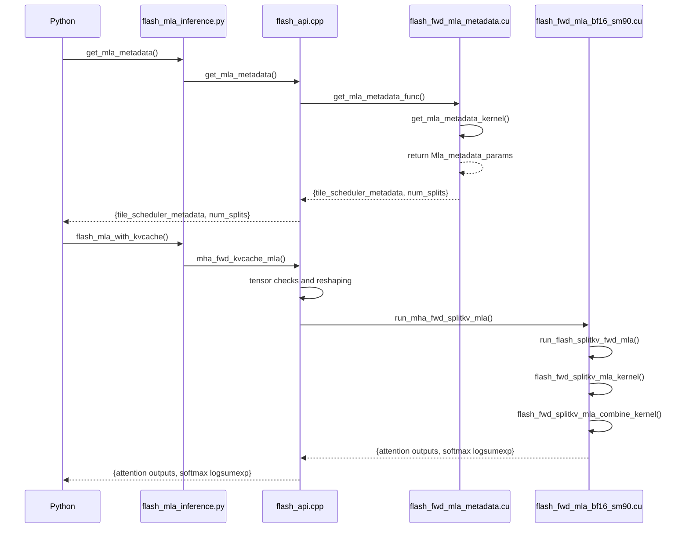

# DeepEP

## code
```sh
|-- csrc
|   |-- CMakeLists.txt
|   |-- config.hpp
|   |-- deep_ep.cpp
|   |-- deep_ep.hpp
|   |-- event.hpp
|   `-- kernels
|       |-- CMakeLists.txt
|       |-- api.cuh
|       |-- buffer.cuh
|       |-- configs.cuh
|       |-- exception.cuh
|       |-- ibgda_device.cuh
|       |-- internode.cu
|       |-- internode_ll.cu
|       |-- intranode.cu
|       |-- launch.cuh
|       |-- runtime.cu
|       `-- utils.cuh
|-- deep_ep
|   |-- __init__.py
|   |-- __pycache__
|   |   |-- __init__.cpython-310.pyc
|   |   |-- buffer.cpython-310.pyc
|   |   `-- utils.cpython-310.pyc
|   |-- buffer.py
|   `-- utils.py
|-- tests
|   |-- __pycache__
|   |   |-- test_low_latency.cpython-38.pyc
|   |   `-- utils.cpython-38.pyc
|   |-- test_internode.py
|   |-- test_intranode.py
|   |-- test_low_latency.py
|   `-- utils.py
`-- third-party
    |-- README.md
    `-- nvshmem.patch
```

## start from python api
